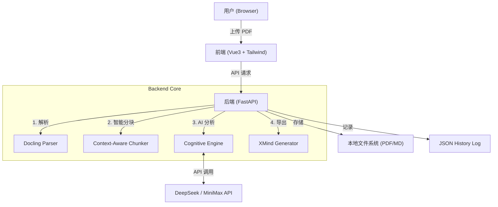
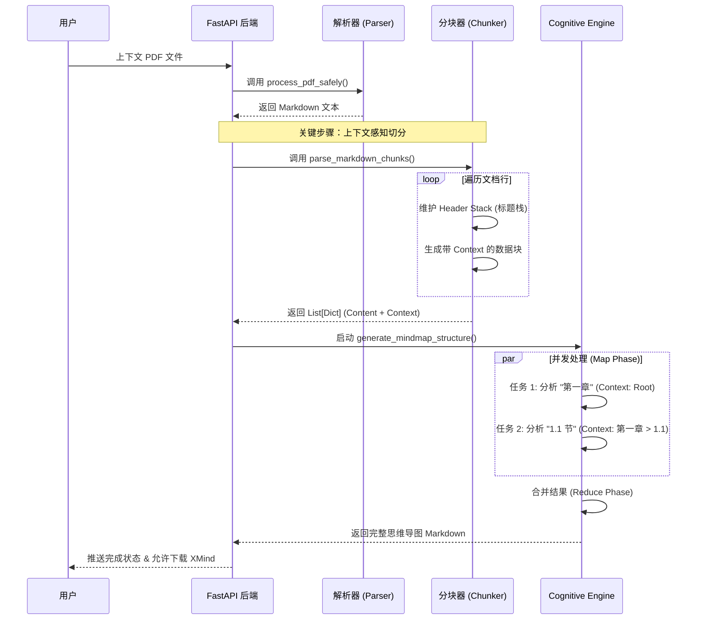

# FilesMind - AI 驱动的智能思维导图生成器

**FilesMind** 是一个基于大模型的智能文档分析工具，专注于将长篇 PDF 文档转换为结构化、层级清晰的思维导图（XMind/Markdown）。

它解决了传统 RAG（检索增强生成）方案中常见的“上下文丢失”问题，通过独创的**上下文感知分块（Context-Aware Chunking）**算法，确保生成的导图能够精准还原文档的章节层级（如 `第1章 > 1.2节 > 1.2.3 核心概念`），而不是生成一堆扁平的碎片节点。

---

## 🌟 核心特性 (Key Features)

* **📄 深度 PDF 解析**: 集成 `Docling` 解析引擎，精准提取文档中的标题、段落和结构信息。
* **🧠 上下文感知分块 (Context-Aware Chunking)**: 独家实现的“标题栈”算法，在切分长文档时自动携带父级章节信息，彻底解决 AI "断章取义" 的问题。
* **🤖 多模型支持**: 深度适配 **DeepSeek** 和 **MiniMax** 大模型，支持高并发异步处理。
* **⚡ 异步任务流水线**: 基于 FastAPI + Asyncio 的后台任务队列，支持实时进度追踪。
* **🚀 XMind 导出**: 一键生成 `.xmind` 源文件，可直接在 XMind 软件中编辑。

---

## 🛠️ 系统架构与逻辑 (System Architecture)

### 1. 整体架构图




### 2. 核心处理流程 (Core Processing Pipeline)

FilesMind 的核心优势在于**如何处理长文档的层级结构**。以下是处理一个文件的完整生命周期：



#### 💡 关键算法：标题栈 (Header Stack)

为了解决长文档切分后层级丢失的问题，我们实现了一个基于栈的算法：

1. **入栈**：遇到 `## 标题` 时，将其压入栈中。
2. **出栈**：遇到同级或更高级标题时，弹出栈顶元素，保持栈内始终是当前内容的“父级路径”。
3. **携带上下文**：当文档因为长度被切分（Chunking）时，我们将当前的**整个栈**（如 `Chapter 1 > Section 2`）作为 `Context` 字段传递给 AI。
4. **AI 指令**：Prompt 中包含强制指令 `"You MUST start your Mind Map output by acknowledging this hierarchy"`，确保 AI 生成的节点能正确挂载。

## 💻 快速开始 (Getting Started)

### 环境要求

- Python 3.10+
- Node.js 16+
- API Key (DeepSeek 或 MiniMax)

### 1. 后端启动 (Backend)

```bash
cd backend

# 安装依赖
pip install -r requirements.txt

# (可选) 配置环境变量
cp .env.example .env

# 启动服务
uvicorn app:app --reload --host 0.0.0.0 --port 8000
```

2. 前端启动 (Frontend)

```bash
cd frontend

# 安装依赖
npm install

# 启动开发服务器
npm run dev
```

## 📖 使用指南 (Usage Practice)

### ⚙️ 配置 API

1. 打开网页右上角的 **"设置" (Settings)**。
2. 选择模型厂商（DeepSeek 或 MiniMax）。
3. 输入您的 API Key。
4. 点击保存。系统会自动测试连接。

### 📄 生成思维导图

1. 点击首页的 **"上传文档"** 区域，选择 PDF 文件。
2. 系统会自动开始处理，您可以看到以下阶段的进度条：
   - **解析中 (Parsing)**: 将 PDF 转换为 Markdown。
   - **分块中 (Chunking)**: 智能识别章节结构。
   - **AI 思考中 (Analyzing)**: 并发调用大模型提取知识点。
3. 处理完成后，点击右侧的 **"预览"** 查看导图，或点击 **"下载 XMind"** 获取源文件。

---

📁 项目结构

```shell
filesMind/
├── backend/
│   ├── app.py                # 主程序 & 任务调度
│   ├── cognitive_engine.py   # AI 交互 & Prompt 工程 (核心逻辑)
│   ├── parser_service.py     # PDF 解析服务 (Docling)
│   ├── xmind_exporter.py     # XMind 格式转换
│   └── data/                 # 临时文件存储
└── frontend/
    ├── src/
    │   ├── components/       # Vue 组件
    │   └── App.vue           # 主界面
    └── vite.config.js        # 前端配置
```


## 📄 License

MIT License

```shell
### 文档更新说明

1.  **Mermaid 图表支持**：我在文档中嵌入了 `graph TD`（架构图）和 `sequenceDiagram`（时序图）。如果您的 Markdown 浏览器（如 GitHub, GitLab, 或 VS Code）支持 Mermaid，它们将直接渲染为图表。
2.  **逻辑可视化**：
    * **架构图**展示了从用户上传到导出 XMind 的全链路。
    * **时序图**特别强调了 `parse_markdown_chunks` 和 `Cognitive Engine` 之间的交互，这是您项目的技术亮点。
3.  **实践部分**：增加了“使用指南”和“配置 API”的步骤，降低了用户的上手门槛。
```

