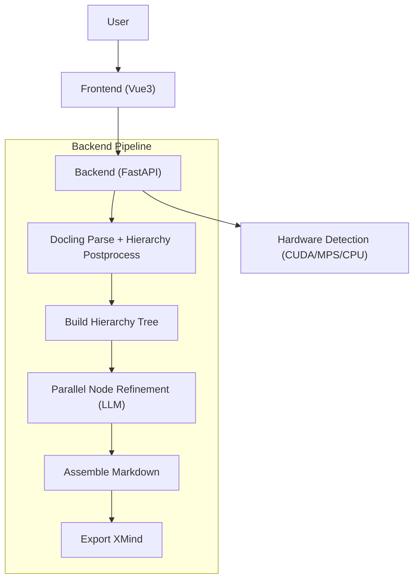

# FilesMind - Deep Knowledge Map Generator Powered by AI

> [English](README.md) | [简体中文](README.zh-CN.md)

> Transform long PDF documents into structured, editable mind maps.

FilesMind is an open-source document analysis tool for deep reading. It uses Docling + LLM reasoning to convert complex PDFs into logically structured mind maps (Markdown / XMind).


---

## Key Features

1. Context-aware document understanding with hierarchy preservation.
2. Hardware-aware parsing acceleration (CUDA / Apple MPS / CPU).
3. Deep PDF parsing via IBM Docling (text, tables, images, formulas).
4. Native `.xmind` export with image support.
5. Frontend-backend decoupled architecture (Vue 3 + FastAPI).

---

## Quick Start

### 1. Prerequisites

- Python `3.12.x` (project is pinned to `==3.12.*`)
- Node.js `>= 18`
- Git

### 2. Clone

```bash
git clone https://github.com/aitangmy/filesMind.git
cd filesMind
```

### 3. Start Backend (uv)

This repo uses `pyproject.toml` + `uv.lock` at project root.

```bash
# Install uv if you don't have it
python -m pip install -U uv

# Sync Python dependencies at repo root
uv sync

# Start backend service
cd backend
uv run uvicorn app:app --reload --host 0.0.0.0 --port 8000
```

After startup, you should see: `Uvicorn running on http://0.0.0.0:8000`.

### 4. Start Frontend

Open a new terminal:

```bash
cd frontend
npm install
npm run dev
```

Then open [http://localhost:5173](http://localhost:5173).

### 5. First-time Setup (Required)

Before uploading PDF, open **Settings** in the UI and set:

1. `API Base URL`
2. `Model`
3. `API Key` (not required for Ollama mode)
4. Click **Test Connection** and then **Save**

Without valid model configuration, processing requests will fail.

---

## Beginner Notes

- Backend API base path is proxied by Vite: frontend uses `/api/*` and maps to `http://localhost:8000/*`.
- Uploaded files and generated outputs are stored under `backend/data/`.
- If your machine is CPU-only, large PDFs may take several minutes.

---

## User Guide

1. Upload a PDF from the top toolbar.
2. Watch task progress and status.
3. Preview the generated map in canvas.
4. Export as Markdown / XMind / PNG.
5. Reopen or delete records from history sidebar.

---

## Troubleshooting

### 1) Backend dependency install fails

- Ensure Python is `3.12.x`.
- Use `uv sync` at repository root.
- This project currently does **not** provide `requirements.txt`.

### 2) Frontend cannot start

- Ensure Node.js version is `>= 18`.
- Reinstall frontend deps:

```bash
cd frontend
rm -rf node_modules package-lock.json
npm install
```

### 3) Upload stuck at processing

- Check backend logs first.
- CPU-only environments can be much slower for OCR/parsing.

### 4) Connection test fails

- Verify API Key and provider endpoint.
- Check network access to your model provider.

---

## Architecture



---

## Project Structure

```text
filesMind/
  backend/                # FastAPI service and document pipeline
  frontend/               # Vue 3 + Vite web UI
  pyproject.toml          # Python dependencies (root)
  uv.lock                 # Locked Python dependency graph
  README.md
  README.zh-CN.md
```

---

## Contributing

Issues and PRs are welcome.

Recommended local check before PR:

```bash
uv run python backend/api_endpoints_test.py
```

---

## License

MIT License. See [LICENSE](LICENSE).
