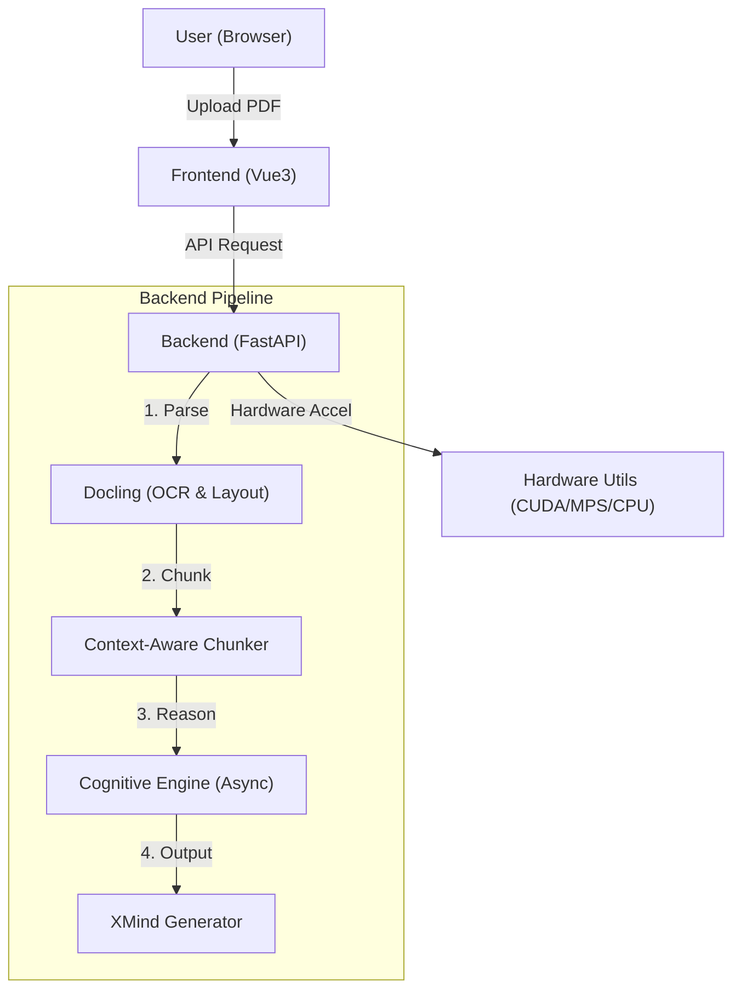

# FilesMind - Deep Knowledge Map Generator Powered by AI

> [English](README.md) | [简体中文](README.zh-CN.md)

> 🚀 **Transform long documents into deep thinking knowledge structures**
>
> FilesMind is an open-source intelligent document analysis tool designed for "Deep Reading". Leveraging LLMs (DeepSeek/MiniMax) and a unique **Recursive Context Awareness** algorithm, it converts complex PDF documents into clear, logically structured mind maps (XMind/Markdown).


---

## 🌟 Key Features (Why FilesMind?)

Traditional "PDF to Mind Map" tools often simply extract headers, resulting in **fragmented maps** with **lack of logical connection**. FilesMind is different:

1.  **🧠 Context-Aware Chunking**: Solves the AI "out of context" problem. When splitting long documents, it automatically maintains a "Header Stack" to ensuring every chunk carries the complete path (e.g., `Chapter 1 > 1.2 Technology > Core Formula`).
2.  **⚡ Intelligent Hardware Acceleration**: Automatically detects your device (NVIDIA GPU / Mac MPS / CPU) and dynamically adjusts the parsing strategy. Achieves extreme parsing speed on Mac M-series chips.
3.  **📄 Deep PDF Parsing**: Integrated with IBM `Docling` engine to accurately identify tables, images, and formulas in documents and restructure them.
4.  **🔗 Native XMind Support**: One-click export to `.xmind` source files, including original image screenshots, ready for editing in XMind software.
5.  **🧩 Modular Architecture**: Decoupled frontend and backend (FastAPI + Vue3), easy to extend and develop.

---

## 🛠️ Quick Start

We ensure you can get the project running **within 5 minutes**. Follow these steps:

### 1. Prerequisites

*   **Python**: Version >= 3.10
*   **Node.js**: Version >= 16.0
*   **Git**: For cloning the code

### 2. Clone the Project

```bash
git clone https://github.com/aitangmy/filesMind.git
cd filesMind
```

### 3. Start Backend

We strongly recommend using the python package manager `uv` (10-100x faster than pip), or use traditional `pip`.

#### Option A: Using uv (Recommended)

```bash
# 1. Enter backend directory
cd backend

# 2. Install uv (skip if installed)
pip install uv

# 3. Sync dependencies (automatically creates venv)
uv sync

# 4. Start service
uv run uvicorn app:app --reload --host 0.0.0.0 --port 8000
```

#### Option B: Using traditional pip

```bash
cd backend

# 1. Create virtual environment
python -m venv .venv

# 2. Activate environment
# Windows:
.venv\Scripts\activate
# Mac/Linux:
source .venv/bin/activate

# 3. Install dependencies
pip install -r requirements.txt

# 4. Start service
uvicorn app:app --reload --host 0.0.0.0 --port 8000
```

> **🔥 GPU Acceleration Tip**:
> *   **Mac Users**: No extra action needed, system automatically uses `MPS` (Metal Performance Shaders).
> *   **NVIDIA Users**: To use GPU acceleration for PDF parsing, uninstall default torch and install the CUDA version:
>     ```bash
>     pip3 install torch torchvision torchaudio --index-url https://download.pytorch.org/whl/cu121
>     ```

After successful startup, you will see `Uvicorn running on http://0.0.0.0:8000`.

### 4. Start Frontend

Open a new terminal window:

```bash
cd frontend

# 1. Install dependencies
npm install

# 2. Start dev server
npm run dev
```

Visit [http://localhost:5173](http://localhost:5173) in your browser! 🎉

---

## 📖 User Guide

The interface is intuitive, divided into three main areas:

### 1. Sidebar (History)
*   **History**: Shows all processed files.
*   **Status Icons**:
    *   `✓` (Green): Completed, click to view.
    *   `⟳` (Yellow): Processing.
    *   `!` (Red): Failed (usually due to corrupted PDF or insufficient API quota).

### 2. Toolbar
*   **Upload Button**: Click to upload PDF. **Note**: If your computer has no GPU and you upload a large file, the system will show a friendly warning.
*   **Settings**:
    *   Configure **API Key** (Supports DeepSeek, MiniMax, OpenAI, etc.).
    *   Select Model (Recommend **DeepSeek-V3** or **MiniMax 2.5** for best cost-performance).
    *   **Account Type**: Some providers (e.g., MiniMax) distinguish between free/paid user concurrency limits, please select correctly to avoid errors.

### 3. Canvas
*   **Mind Map Preview**: Real-time Markdown rendering, supports zoom and drag.
*   **Download XMind**: After processing, click the download button top-right to get the `.xmind` file.

---

## ❓ Troubleshooting

**Q1: Stuck at "Processing..." after upload?**
*   **Reason**: PDF parsing (OCR) consumes significant computing resources.
*   **Solution**:
    *   Check backend terminal logs.
    *   If on **Pure CPU Environment**, parsing a 50-page PDF may take 3-5 minutes, please interpret patiently.
    *   Ensure backend hasn't crashed.

**Q2: "Connection Error" or Test Config Failed?**
*   **Reason**: Wrong API Key or network issues.
*   **Solution**:
    *   Check if API Key has balance.
    *   Ensure network can access the LLM provider API.
    *   Backend has CORS enabled by default, cross-origin issues are rare.

**Q3: OpenMP Error on Windows?**
*   **Solution**: We added `os.environ["KMP_DUPLICATE_LIB_OK"] = "TRUE"` in code to auto-fix this. If it persists, ensure only one PyTorch version is installed.

---

## 🏗️ Architecture



## 📄 License

This project is open-sourced under the [MIT License](LICENSE). Fork and PRs are welcome!
