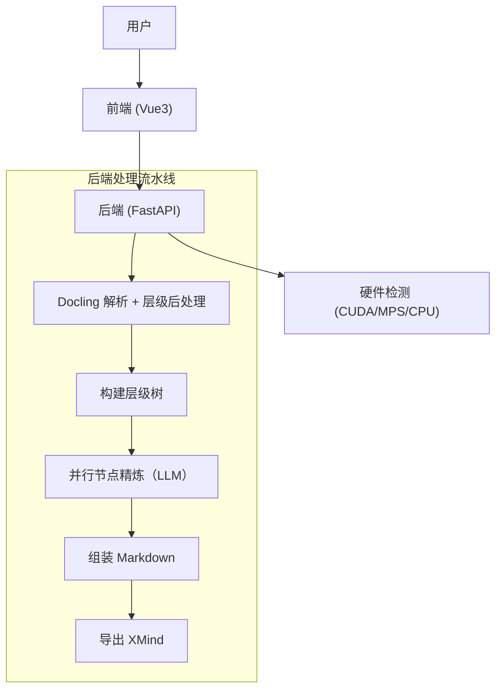

# FilesMind - AI 驱动的深度知识导图生成器

> [English](README.md) | [简体中文](README.zh-CN.md)

> 将长篇 PDF 文档转化为结构化、可编辑的知识导图。

FilesMind 是一个开源文档分析工具，面向深度阅读场景。它结合 Docling 与大模型推理，将复杂 PDF 转换为逻辑清晰的思维导图（Markdown / XMind）。


---

## 核心特性

1. 保留层级上下文的文档理解能力。
2. 智能硬件加速（CUDA / Apple MPS / CPU）。
3. 基于 IBM Docling 的深度 PDF 解析（文本、表格、图片、公式）。
4. 原生 `.xmind` 导出，支持图片。
5. 前后端分离架构（Vue 3 + FastAPI）。
6. 可切换 PDF 解析后端：`docling` / `marker` / `hybrid`。

---

## 快速开始

### 1. 环境要求

- Python `3.12.x`（项目固定为 `==3.12.*`）
- Node.js `>= 18`
- Git

### 2. 克隆项目

```bash
git clone https://github.com/aitangmy/filesMind.git
cd filesMind
```

### 3. 启动后端（uv）

本项目在仓库根目录使用 `pyproject.toml` + `uv.lock` 管理 Python 依赖。

```bash
# 如未安装 uv
python -m pip install -U uv

# 在仓库根目录同步依赖
uv sync

# 启动后端服务
cd backend
uv run uvicorn app:app --reload --host 0.0.0.0 --port 8000
```

启动成功后会看到：`Uvicorn running on http://0.0.0.0:8000`。

### 4. 启动前端

另开一个终端：

```bash
cd frontend
npm install
npm run dev
```

浏览器访问 [http://localhost:5173](http://localhost:5173)。

### 5. 首次使用必做配置

上传 PDF 前，请先在界面右上角 **Settings** 完成：

1. `API Base URL`
2. `Model`
3. `API Key`（Ollama 模式可为空）
4. 点击 **测试连接**，再点击 **保存配置**

如果模型配置无效，上传后会处理失败。

### 6. 可选：启用 Marker/Hybrid 解析

现在可通过环境变量切换解析后端：

- `PARSER_BACKEND=docling`（默认）
- `PARSER_BACKEND=marker`
- `PARSER_BACKEND=hybrid`（先 Docling，噪声高时自动回退 Marker）

先安装 Marker：

```bash
uv pip install marker-pdf
```

以 hybrid 模式启动后端：

```bash
cd backend
PARSER_BACKEND=hybrid uv run uvicorn app:app --reload --host 0.0.0.0 --port 8000
```

可选：调整回退阈值（无效标题比例）

```bash
HYBRID_NOISE_THRESHOLD=0.20
```

注意：`marker-pdf` / `surya-ocr` 的许可证与本仓库 MIT 不同；若用于再分发或商业场景，请先做许可证合规评估。

---

## 新手提示

- 前端请求 `/api/*` 会被 Vite 代理到 `http://localhost:8000/*`。
- 上传文件与生成结果会落盘到 `backend/data/`。
- 纯 CPU 环境下，大 PDF 处理可能需要几分钟。

---

## 使用流程

1. 在顶部工具栏上传 PDF。
2. 观察任务状态和进度。
3. 在主画布预览导图。
4. 导出 Markdown / XMind / PNG。
5. 在左侧历史记录中复用或删除结果。

---

## 常见问题

### 1）后端依赖安装失败

- 先确认 Python 为 `3.12.x`。
- 在仓库根目录执行 `uv sync`。
- 当前仓库 **没有** `requirements.txt`。

### 2）前端启动失败

- 确认 Node.js 版本 `>= 18`。
- 可重装依赖：

```bash
cd frontend
rm -rf node_modules package-lock.json
npm install
```

### 3）上传后长时间处理中

- 先看后端日志。
- 纯 CPU 环境 OCR 解析会明显更慢。

### 4）连接测试失败

- 检查 API Key 与服务商地址是否正确。
- 检查网络是否可访问对应模型服务。

---

## 技术架构



---

## 项目结构

```text
filesMind/
  backend/                # FastAPI 服务与文档处理流水线
  frontend/               # Vue 3 + Vite 界面
  pyproject.toml          # Python 依赖（根目录）
  uv.lock                 # Python 锁定依赖
  README.md
  README.zh-CN.md
```

---

## 贡献指南

欢迎提交 Issue 和 PR。

建议在发 PR 前先做本地检查：

```bash
uv run python backend/api_endpoints_test.py
```

---

## 开源许可

本项目采用 MIT License，详见 [LICENSE](LICENSE)。
