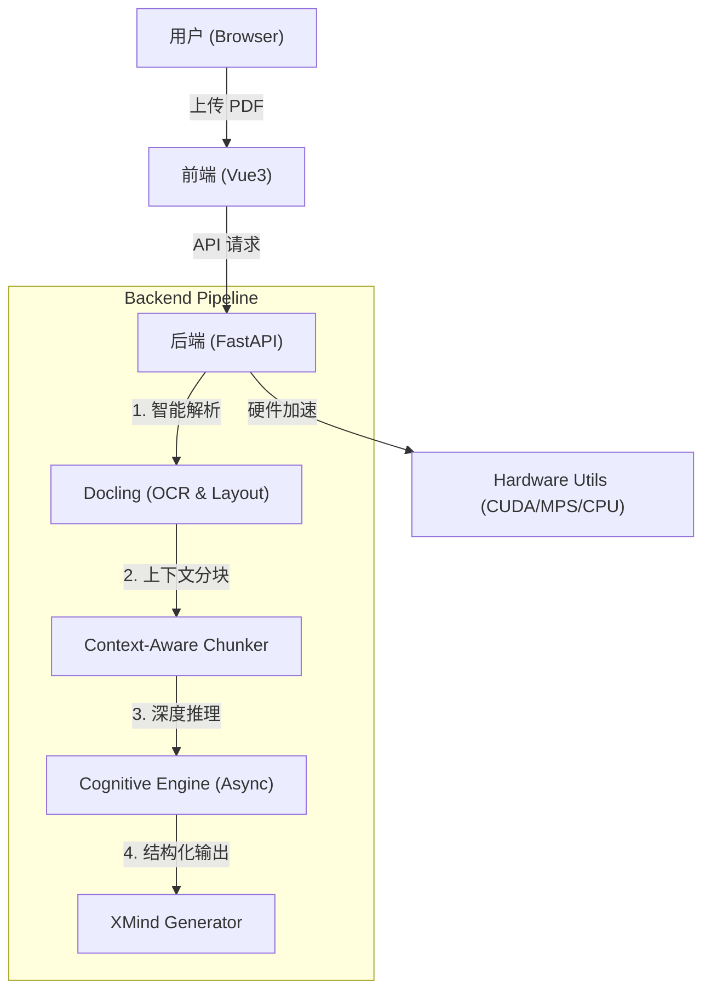

# FilesMind - AI 驱动的深度知识导图生成器

> [English](README.md) | [简体中文](README.zh-CN.md)

> 🚀 **将长文档转化为深度思考的知识结构**
> 
> FilesMind 是一个开源的智能文档分析工具，专为“深度阅读”设计。它利用 LLM（DeepSeek/MiniMax）通过独创的**递归上下文分块（Recursive Context Awareness）**算法，将复杂的 PDF 文档转化为层级清晰、逻辑严密的思维导图。


---

## 🌟 核心亮点 (Why FilesMind?)

传统的 "PDF 转导图" 工具往往只是简单的提取标题，生成的导图**碎片化严重**且**缺乏逻辑关联**。FilesMind 的不同之处在于：

1.  **🧠 上下文防丢失算法**: 彻底解决 AI "断章取义" 的问题。在切分长文档时，自动维护“标题栈（Header Stack）”，确保每个切片都携带完整的章节路径（如 `第1章 > 1.2 技术原理 > 核心公式`）。
2.  **⚡ 智能硬件加速**: 自动检测您的设备（NVIDIA GPU / Mac MPS / CPU），动态调整解析策略。在 Mac M系列芯片上可获得极致的解析速度。
3.  **📄 深度 PDF 解析**: 集成 IBM `Docling` 引擎，精准识别文档中的表格、图片、公式，并将其重组为结构化数据。
4.  **🔗 XMind 原生支持**: 一键导出 `.xmind` 源文件，甚至包括原文中的图片截图，可直接在 XMind 软件中进行二次编辑。
5.  **🧩 模块化架构**: 前后端分离（FastAPI + Vue3），易于扩展和二次开发。

---

## 🛠️ 快速开始 (Quick Start)

我们要确保你能**在 5 分钟内**把项目跑起来。请跟随以下步骤：

### 1. 环境准备 (Prerequisites)

*   **Python**: 版本需 >= 3.10
*   **Node.js**: 版本需 >= 16.0
*   **Git**: 用于克隆代码

### 2. 克隆项目

```bash
git clone https://github.com/your-username/filesMind.git
cd filesMind
```

### 3. 启动后端 (Backend)

我们强烈推荐使用 python 包管理器 `uv` (比 pip 快 10-100 倍)，或者使用传统的 `pip`。

#### 方式 A: 使用 uv (推荐)

```bash
# 1. 进入后端目录
cd backend

# 2. 安装 uv (如果已安装可跳过)
pip install uv

# 3. 同步依赖 (自动创建虚拟环境)
uv sync

# 4. 启动服务
uv run uvicorn app:app --reload --host 0.0.0.0 --port 8000
```

#### 方式 B: 使用传统 pip

```bash
cd backend

# 1. 创建虚拟环境
python -m venv .venv

# 2. 激活环境
# Windows:
.venv\Scripts\activate
# Mac/Linux:
source .venv/bin/activate

# 3. 安装依赖
pip install -r requirements.txt

# 4. 启动服务
uvicorn app:app --reload --host 0.0.0.0 --port 8000
```

> **🔥 GPU 加速提示**: 
> *   **Mac 用户**: 无需额外操作，系统会自动调用 `MPS` (Metal Performance Shaders) 加速。
> *   **NVIDIA 用户**: 如果你想用 GPU 加速 PDF 解析，请卸载默认 torch 并安装 CUDA 版本：
>     ```bash
>     pip3 install torch torchvision torchaudio --index-url https://download.pytorch.org/whl/cu121
>     ```

后端启动成功后，你会看到类似 `Uvicorn running on http://0.0.0.0:8000` 的提示。

### 4. 启动前端 (Frontend)

打开一个新的终端窗口：

```bash
cd frontend

# 1. 安装依赖
npm install

# 2. 启动开发服务器
npm run dev
```

浏览器访问 [http://localhost:5173](http://localhost:5173) 即可看到界面！🎉

---

## 📖 使用指南 (User Guide)

界面布局直观，主要分为三个区域：

### 1. 左侧侧边栏 (History)
*   **历史记录**: 显示所有处理过的文件。
*   **状态图标**: 
    *   `✓` (绿色): 处理完成，点击即可查看。
    *   `⟳` (黄色): 正在处理中。
    *   `!` (红色): 处理失败（通常是 PDF 损坏或 API 额度不足）。

### 2. 顶部导航栏 (Toolbar)
*   **上传按钮**: 点击上传 PDF。**注意**: 如果您的电脑没有 GPU 且上传了大文件，系统会弹出温馨提示，建议确认。
*   **设置 (Settings)**: 
    *   配置 **API Key** (支持 DeepSeek, MiniMax, OpenAI 等)。
    *   选择模型 (推荐 **DeepSeek-V3** 或 **MiniMax 2.5** 以获得最佳性价比)。
    *   **账户类型**: 部分服务商（如 MiniMax）区分免费/付费用户的并发限制，请正确选择以防报错。

### 3. 主视图 (Canvas)
*   **思维导图预览**: 实时渲染 Markdown 导图，支持缩放、拖拽。
*   **下载 XMind**: 处理完成后，点击右上角下载按钮，获取 `.xmind` 文件。

---

## ❓ 常见问题 (Troubleshooting)

**Q1: 上传文件后一直显示 "Processing..." 进度条卡住？**
*   **原因**: 主要是 PDF 解析（OCR）非常消耗计算资源。
*   **解决**: 
    *   请查看后端终端的日志输出。
    *   如果是 **纯 CPU 环境**，解析 50 页的 PDF 可能需要 3-5 分钟，请耐心等待。
    *   确保后端没有报错退出。

**Q2: 提示 "Connection Error" 或配置测试失败？**
*   **原因**: API Key 错误或网络问题。
*   **解决**: 
    *   检查 API Key 是否有余额。
    *   国内用户请确保网络能访问对应的 LLM 服务商 API。
    *   后端默认开启了 CORS，一般不会有跨域问题。

**Q3: 为什么 Windows 上报 OpenMP 错误？**
*   **解决**: 我们已经在代码中添加了 `os.environ["KMP_DUPLICATE_LIB_OK"] = "TRUE"` 自动修复此问题。如果仍报错，请确保只安装了一个 PyTorch 版本。

---

## 🏗️ 技术架构 (Architecture)



## 📄 License

本项目采用 [MIT License](LICENSE) 开源。欢迎 Fork 和 PR！
